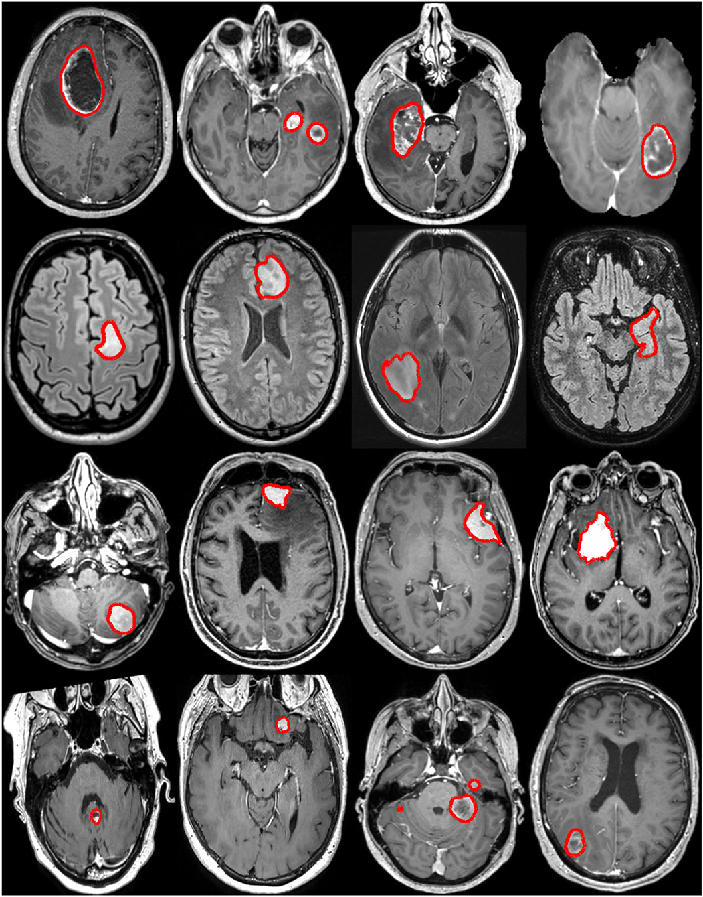
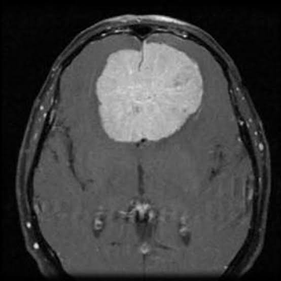
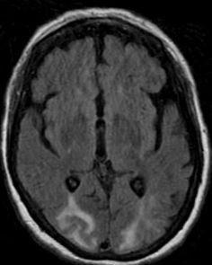
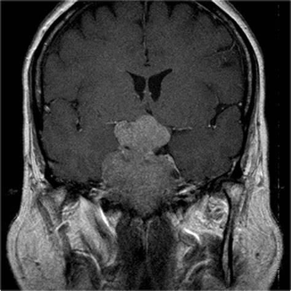
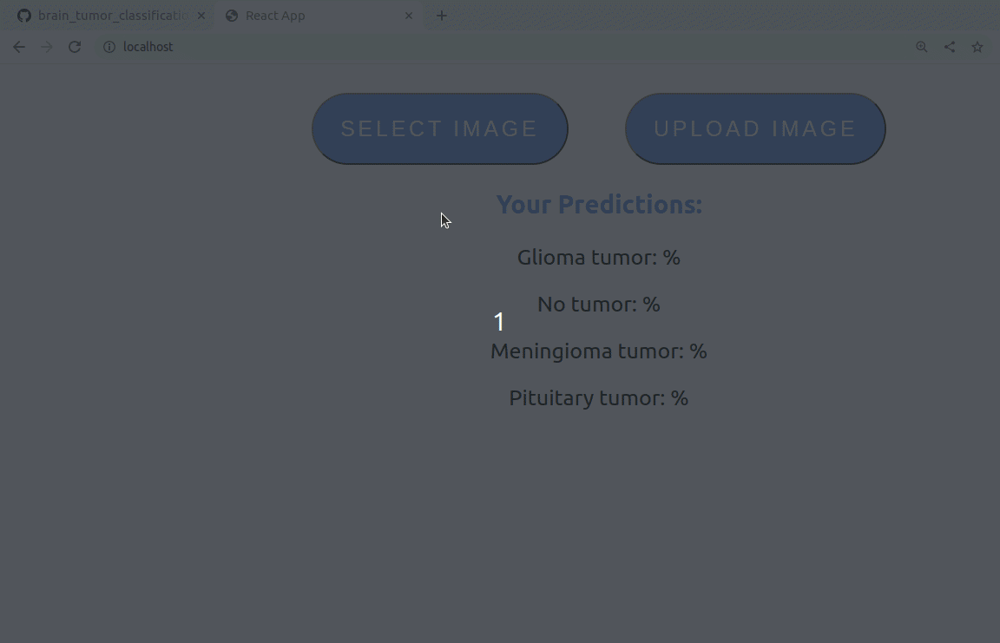

This is a ***FastAPI + React JS + nginx*** application for brain tumor classification. 
It uses trained xgboost model with 75% accuracy. You can see how it was trained in [**notebook.ipynb**](https://github.com/xtbtds/brain_tumor_prediction/blob/main/backend/notebook.ipynb)  

# Table of contents
* [Problem description](#problem-description)
* [Dataset](#dataset)
* [Usage](#usage)
* [Run notebook in the virtual environment](#run-notebook-in-the-virtual-environment)
* [Deploy to AWS](#deploy-to-aws)

# Problem description
A brain tumor is a mass or growth of abnormal cells in your brain.  

  

Many different types of brain tumors exist. Some brain tumors are noncancerous (benign), and some brain tumors are cancerous (malignant). Brain tumors can begin in your brain (primary brain tumors), or cancer can begin in other parts of your body and spread to your brain as secondary (metastatic) brain tumors.

How quickly a brain tumor grows can vary greatly. The growth rate as well as the location of a brain tumor determines how it will affect the function of your nervous system.

Application of automated classification techniques using AI has consistently shown higher accuracy than manual classification. This reposutory provides a solution to the problem.

# Dataset

[Link to the dataset](https://github.com/sartajbhuvaji/brain-tumor-classification-dataset)  
Dataset consists of 4 classes of images, which represent 3 types of brain tumor and no tumor at all:
1. Glioma tumor
2. Meningioma tumor
3. No tumor
4. Pituitary tumor

  
  
  
  

# Usage 
- `git clone https://github.com/xtbtds/brain_tumor_classification_mlzoomcamp`
- `cd <project folder>`
- `docker-compose up`
- wait for docker-compose to build and run images.
- go to `http://localhost` 
- click "select" button to select an image from your computer, then click upload to upload it to the service.
- wait a little bit (5-10 s) and you'll see the probabilies of different deceases

 

**Note:** you don't need to download the whole repo if you don't want to. Another way to run the app is to use [this  docker-compose file](https://github.com/xtbtds/brain_tumor_classification/blob/main/pulled/docker-compose.yml). It pulles already built images from docker hub. Copy this file to your local machine and run `docker-compose up`. 

# Run notebook in the virtual environment
Go to [training directory](https://github.com/xtbtds/brain_tumor_classification_mlzoomcamp/tree/main/training) and run the following commands:
1. `sudo pip3 install virtualenv`
2. `virtualenv venv`
3. Activate virtual environment: `source venv/bin/activate`
4. Install dependencies for running training process: `pip3 install -r requirements.txt`
5. `jupyter notebook`

# Deploy to AWS
1. Go to AWS, sign in to the console and create ubuntu EC2 instance, create and download your .pem file with the key 
2. Give your .pem file the right permissions, otherwise it won't let you to ssh to your EC2 instance because of wrong permissions:
  - `chmod 0400 <YOUR_PEM_FILE.pem>`
3. Connect to your EC2 instance:
  - `ssh -i <YOUR_PEM_FILE>.pem ubuntu@<your_ec2_public_public_IP>`
4. Run this steps to install docker and docker-compose to your EC2 ubuntu machine:
  - `yum update -y`
  - `amazon-linux-extras install docker -y`
  - `service docker start`
  - `systemctl enable docker`
  - `usermod -a -G docker ec2-user`
  - `chmod 666 /var/run/docker.sock`
  - `curl -L https://github.com/docker/compose/releases/download/1.22.0/docker-compose-$(uname -s)-$(uname -m) -o /usr/local/bin/docker-compose`
  - `chmod +x /usr/local/bin/docker-compose`
5. Copy the content of [this  docker-compose file](https://github.com/xtbtds/brain_tumor_classification/blob/main/pulled/docker-compose.yml) to your EC2 instance manually, or using command `scp -i <YOUR_PEM_FILE>.pem -r <path_to_dockercompose_file> ubuntu@<your_ec2_public_public_IP>:/home/ubuntu`
6. Connect to your EC2 instance via ssh again and run `docker-compose up`
7. Copy Public IPv4 address of your instance to the new tab, wait a little bit and you'll see this service deployed to the cloud.
